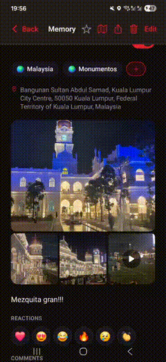

# expo-media-viewer

[](https://github.com/JuanRdBO/expo-media-viewer/actions/workflows/validate.yml)
[](https://www.npmjs.com/package/expo-media-viewer)
[](https://www.npmjs.com/package/expo-media-viewer)

Native fullscreen photo and video viewer for React Native, built as an [Expo Module](https://docs.expo.dev/modules/overview/). Tap a thumbnail to open a fullscreen viewer with smooth shared-element transitions, pinch-to-zoom, swipe-to-dismiss, and inline video playback.

Inspired by [@nandorojo/galeria](https://github.com/nandorojo/galeria) — extended with video support, GPS extraction, and custom transition animations.

<table align="center">
  <tr>
    <th>iOS</th>
    <th>Android</th>
  </tr>
  <tr>
    <td></td>
    <td></td>
  </tr>
</table>

## Features

- **Pinch-to-zoom** — smooth, hardware-accelerated zoom on images (iOS: custom UIScrollView, Android: [PhotoView](https://github.com/chrisbanes/PhotoView))
- **Swipe-to-dismiss** — drag down to close with a fluid animation back to the source thumbnail
- **Shared-element transitions** — the viewer animates from and back to the tapped thumbnail with matching corner radius
- **Video playback** — inline video support (iOS: AVPlayerViewController, Android: Media3 ExoPlayer)
- **Multi-image gallery** — swipe between multiple images/videos with a ViewPager (page indicator dots included)
- **Dark and light themes** — control the viewer background and chrome color
- **GPS extraction (Android)** — read EXIF GPS coordinates from photos via MediaStore, bypassing Android 10+ scoped storage stripping
- **Fabric & Classic support** — works with both the New Architecture (Fabric) and the Classic Architecture
- **Web fallback** — gracefully renders children without the native viewer on web/unsupported platforms

## Installation

```bash
npx expo install expo-media-viewer
```

Then rebuild your dev client:

```bash
npx expo prebuild --clean
npx expo run:ios   # or run:android
```

> Requires a [dev client](https://docs.expo.dev/develop/development-builds/introduction/) — will not work in Expo Go. This package includes native code (Swift + Kotlin) that must be compiled into your app binary.

### Android dependencies

The Android implementation uses these libraries (bundled in the module's `build.gradle`):

- `androidx.media3:media3-exoplayer` — video playback
- `com.github.chrisbanes:PhotoView` — pinch-to-zoom
- `com.github.bumptech.glide:glide` — image loading
- `androidx.viewpager2:viewpager2` — page swiping

No extra setup is required; they are resolved automatically.

## Usage

Wrap your image list with `<MediaViewer>` and use `<MediaViewer.Image>` around each thumbnail:

```tsx
import { MediaViewer } from "expo-media-viewer";
import { Image } from "react-native";

const urls = [
  "https://example.com/photo1.jpg",
  "https://example.com/photo2.jpg",
  "https://example.com/video.mp4",
];

function Gallery() {
  return (
    <MediaViewer
      urls={urls}
      theme="dark"
      mediaTypes={["image", "image", "video"]}
    >
      {urls.map((url, index) => (
        <MediaViewer.Image
          key={url}
          index={index}
          onIndexChange={(e) => console.log("Current index:", e.nativeEvent.currentIndex)}
        >
          <Image
            source={{ uri: url }}
            style={{ width: 120, height: 120, borderRadius: 12 }}
          />
        </MediaViewer.Image>
      ))}
    </MediaViewer>
  );
}
```

### Reading GPS from a photo (Android only)

```ts
import { readGpsFromPhoto } from "expo-media-viewer";

const coords = await readGpsFromPhoto(assetId, fileName);
if (coords) {
  console.log(coords.latitude, coords.longitude);
}
```

This uses `MediaStore.setRequireOriginal()` to bypass Android 10+ scoped storage GPS stripping. Returns `null` on iOS or if no GPS data is found.

## API

### `<MediaViewer>` (Provider)

Wraps your gallery and provides shared configuration via React Context.

| Prop | Type | Default | Description |
|---|---|---|---|
| `urls` | `string[]` | — | Array of image/video URLs to display in the fullscreen viewer |
| `theme` | `"dark" \| "light"` | `"dark"` | Background color theme for the fullscreen viewer |
| `mediaTypes` | `string[]` | — | Per-URL media type hint (e.g. `["image", "video"]`). Used to determine whether to show the photo viewer or video player for each item |
| `hideBlurOverlay` | `boolean` | `false` | *iOS only.* Hide the blur overlay behind the viewer |
| `hidePageIndicators` | `boolean` | `false` | Hide the page indicator dots when viewing multiple items |

### `<MediaViewer.Image>`

Wraps a single thumbnail image. Tapping it opens the fullscreen viewer at the corresponding index.

| Prop | Type | Default | Description |
|---|---|---|---|
| `index` | `number` | `0` | Index of this item in the `urls` array |
| `id` | `string` | — | Optional identifier for this viewer instance |
| `onIndexChange` | `(event: MediaViewerIndexChangedEvent) => void` | — | Called when the user swipes to a different page. `event.nativeEvent.currentIndex` is the new index |
| `hideBlurOverlay` | `boolean` | — | *iOS only.* Override the provider-level setting for this instance |
| `hidePageIndicators` | `boolean` | — | Override the provider-level setting for this instance |
| `edgeToEdge` | `boolean` | — | *Android only.* Enable edge-to-edge display in the viewer dialog |
| `style` | `ViewStyle` | — | Style applied to the wrapper view |
| `children` | `ReactElement` | *required* | The thumbnail element (typically an `<Image>`) |

### `readGpsFromPhoto(assetId, fileName)`

*Android only.* Reads GPS coordinates from a photo's EXIF data.

| Parameter | Type | Description |
|---|---|---|
| `assetId` | `string \| null` | MediaStore asset ID (e.g. from expo-image-picker) |
| `fileName` | `string \| null` | Filename fallback — queries MediaStore by `DISPLAY_NAME` |

Returns `Promise<{ latitude: number; longitude: number } | null>`. Returns `null` on iOS.

## Platform details

### iOS

- Fullscreen viewer presented as a custom `UIViewController` with `UIPageViewController` for swiping
- Pinch-to-zoom via a `UIScrollView` with `minimumZoomScale` / `maximumZoomScale`
- Shared-element transition powered by a custom `MatchTransition` animation engine (included in the module)
- Video playback via `AVPlayerViewController`
- Blur overlay behind the viewer (optional)
- Keyboard is automatically dismissed when opening the viewer and restored on close

### Android

- Fullscreen viewer presented as a `DialogFragment` with `ViewPager2`
- Pinch-to-zoom via [PhotoView](https://github.com/chrisbanes/PhotoView)
- Image loading via [Glide](https://github.com/bumptech/glide)
- Video playback via [Media3 ExoPlayer](https://developer.android.com/media/media3/exoplayer) with TextureView
- Shared-element enter/exit animation with uniform scale and corner radius interpolation
- Swipe-to-dismiss with scale + fade + rotation
- Edge-to-edge support (transparent status/navigation bars)

## Requirements

- Expo SDK 52+
- React Native 0.76+
- iOS 15.1+
- Android minSdk 24

## License

MIT
