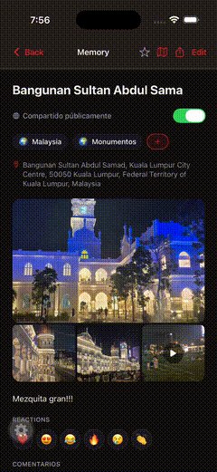
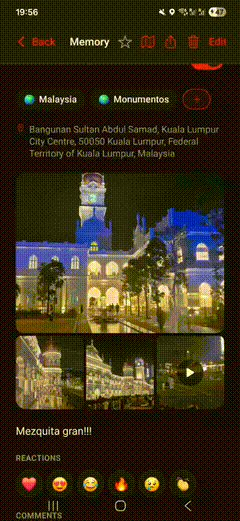

<h1 align="center">expo-media-viewer</h1>

<p align="center">
  Fullscreen galleries for Expo apps with images, videos, thumbnails, transitions, zoom, and authenticated media URLs on iOS, Android, and web.
</p>

<p align="center">
  <a href="https://github.com/JuanRdBO/expo-media-viewer/actions/workflows/validate.yml"></a>
  <a href="https://www.npmjs.com/package/expo-media-viewer"></a>
  <a href="https://www.npmjs.com/package/expo-media-viewer"></a>
</p>

<table align="center">
  <tr>
    <td align="center"><strong>iOS</strong></td>
    <td align="center"><strong>Android</strong></td>
  </tr>
  <tr>
    <td></td>
    <td></td>
  </tr>
</table>

Use it when your app has a feed, chat, profile, memory timeline, marketplace listing, or gallery where a thumbnail should open into a polished fullscreen viewer. You pass the media model once, render whatever layout you want, and the package owns the hard parts: image zoom, video playback, open/close transitions, thumbnail rendering, swipe-to-dismiss, fullscreen chrome, and request headers.

Inspired by [@nandorojo/galeria](https://github.com/nandorojo/galeria), redesigned around mixed image/video collections.

## Why It Feels Different

| Built for | What you get |
|---|---|
| Mixed media | Images and videos share one `items` array instead of separate image-only props |
| Real app layouts | Bring your own grid, feed, carousel, or masonry UI through `renderLayout` |
| Package-owned thumbnails | Static images, posters, muted looping video previews, and video duration badges |
| Cross-platform fullscreen UX | Native on iOS/Android, with a fluid web overlay for desktop and mobile browsers |
| Live video previews | Muted looping thumbnails use native players on mobile and browser video on web |
| Private media | Global request headers plus per-item and per-thumbnail overrides |

## Highlights

- **One source of truth** - define media, thumbnails, headers, chrome, and duration in `items`
- **Any layout** - call `renderItem(index, options)` wherever a tappable thumbnail should appear
- **Image and video support** - videos get native playback plus a built-in play indicator by default
- **Live previews** - `loop-muted` video thumbnails play inline, pause offscreen, and open smoothly
- **Transition matching** - thumbnail size and `borderRadius` are reused by the native open/close animation
- **Blurhash placeholders** - keep package-owned thumbnails from flashing empty while images or video posters load
- **Authenticated URLs** - attach headers globally or per item for private CDNs and signed media
- **Local assets** - supports URI strings, `require(...)`, and `Image.resolveAssetSource(...)` style sources
- **iOS, Android, and web** - native mobile viewers plus a browser viewer with keyboard, swipe, zoom, and video support
- **Fabric and Classic support** - works with both React Native architectures

## Installation

```bash
npx expo install expo-media-viewer expo-image expo-asset
```

For web builds, make sure the Expo web runtime packages are installed too:

```bash
npx expo install react-dom react-native-web
```

Then rebuild your dev client for iOS or Android:

```bash
npx expo prebuild --clean
npx expo run:ios   # or run:android
```

This package includes native Swift and Kotlin code, so iOS and Android require a development build. Web works through the browser implementation.

## Usage

```tsx
import { MediaViewer, type MediaViewerItem } from "expo-media-viewer";
import { View } from "react-native";

const items: MediaViewerItem[] = [
  {
    type: "image",
    source: "https://example.com/photo.jpg",
    blurhash: "LEHV6nWB2yk8pyo0adR*.7kCMdnj",
    chrome: {
      title: "Beach sunset",
      subtitle: "July 2025",
      footer: "1 / 2",
    },
  },
  {
    type: "video",
    source: "https://example.com/video.mp4",
    thumbnail: {
      source: "https://example.com/video-poster.jpg",
      mode: "loop-muted",
      blurhash: "LGF5]+Yk^6#M@-5c,1J5@[or[Q6.",
    },
    duration: "0:18",
    chrome: {
      title: "Drone footage",
      subtitle: "September 2025",
      footer: "2 / 2",
    },
  },
];

export function Gallery() {
  return (
    <MediaViewer
      items={items}
      config={{
        theme: "dark",
        thumbnail: { fit: "cover", videoMode: "loop-muted" },
      }}
      onIndexChange={(event) => {
        console.log("Current index:", event.nativeEvent.currentIndex);
      }}
      renderLayout={({ items, renderItem }) => (
        <View style={{ flexDirection: "row", gap: 8 }}>
          {items.map((_item, index) =>
            renderItem(index, {
              frame: { width: 120, height: 120, borderRadius: 12 },
            }),
          )}
        </View>
      )}
    />
  );
}
```

Video items automatically get a play indicator. If `duration` is present, it is shown inside that indicator.

## Live Video Thumbnails

Set a video thumbnail to `mode: "loop-muted"` when the thumbnail should be a live muted preview. The package owns the playback surface for that item:

- iOS uses one `AVPlayer` session for the thumbnail and fullscreen viewer.
- Android uses one Media3 `ExoPlayer` session and switches the target `PlayerView`.
- Web uses browser video thumbnails, pauses them when they scroll offscreen, and opens fullscreen near the current playback time.
- On iOS and Android, opening a live thumbnail keeps the same playback session instead of starting at `0:00`.
- On web, opening fullscreen starts near the thumbnail's current playback time.
- Dismissing fullscreen returns to the muted thumbnail preview.

If `thumbnail.source` is provided, it is used as the poster/fallback while the live video prepares. If it is omitted, the thumbnail falls back to `thumbnail.blurhash`, `blurhash`, or a neutral placeholder until the first video frame is ready.

## Request Headers

Use `config.request.headers` for defaults, then override them on item-level `headers` or `thumbnail.headers`.

```tsx
<MediaViewer
  items={[
    {
      type: "video",
      source: "https://media.example.com/private/video.mp4",
      headers: { "X-Media-Scope": "original" },
      thumbnail: {
        source: "https://media.example.com/private/poster.jpg",
        headers: { "X-Media-Scope": "thumbnail" },
        mode: "loop-muted",
      },
      duration: "0:24",
    },
  ]}
  config={{
    request: {
      headers: { Authorization: `Bearer ${token}` },
    },
  }}
  renderLayout={({ renderItem }) =>
    renderItem(0, { frame: { width: 160, height: 160 } })
  }
/>
```

Header precedence:

- Media requests use `{ ...config.request.headers, ...item.headers }`
- Thumbnail requests use `{ ...config.request.headers, ...(item.thumbnail?.headers ?? item.headers) }`

## Asset Sources

`source` and `thumbnail.source` accept URI strings or React Native image sources. Local assets are resolved with React Native's asset resolver before they are passed to the native viewer.

```tsx
const items: MediaViewerItem[] = [
  {
    type: "image",
    source: require("./assets/photo.jpg"),
  },
  {
    type: "video",
    source: "https://example.com/video.mp4",
    thumbnail: { source: require("./assets/video-poster.jpg") },
  },
];
```

## Blurhash Placeholders

Add `blurhash` for the default image thumbnail placeholder. Use `thumbnail.blurhash` when the thumbnail or video poster needs its own placeholder.

```tsx
const items: MediaViewerItem[] = [
  {
    type: "image",
    source: "https://example.com/photo.jpg",
    blurhash: "LEHV6nWB2yk8pyo0adR*.7kCMdnj",
  },
  {
    type: "video",
    source: "https://example.com/video.mp4",
    thumbnail: {
      source: "https://example.com/poster.jpg",
      blurhash: "LGF5]+Yk^6#M@-5c,1J5@[or[Q6.",
      mode: "loop-muted",
    },
  },
];
```

For larger generated placeholders, pass dimensions:

```tsx
thumbnail: {
  blurhash: {
    hash: "LEHV6nWB2yk8pyo0adR*.7kCMdnj",
    width: 32,
    height: 32,
  },
}
```

## API

### `<MediaViewer>`

| Prop | Type | Default | Description |
|---|---|---|---|
| `items` | `MediaViewerItem[]` | required | Single source of truth for image/video data |
| `renderLayout` | `(args: MediaViewerLayoutRenderArgs) => ReactNode` | required | Render your layout. Call `renderItem(index, options)` for each tappable media item |
| `config` | `MediaViewerConfig` | - | Viewer theme, request defaults, thumbnail defaults, video indicator behavior, and native viewer options |
| `onIndexChange` | `(event: MediaViewerIndexChangedEvent) => void` | - | Called when the fullscreen viewer changes pages |
| `onVideoError` | `(event: MediaViewerVideoErrorEvent) => void` | - | Called when native video loading fails |

### `MediaViewerItem`

| Prop | Type | Default | Description |
|---|---|---|---|
| `id` | `string` | generated | Stable key for the item |
| `type` | `"image" \| "video"` | required | Media type |
| `source` | `string \| ImageSourcePropType` | required | Fullscreen image or video source |
| `headers` | `Record<string, string>` | - | Headers for the fullscreen media request |
| `blurhash` | `string \| { hash: string; width?: number; height?: number }` | - | Blurhash placeholder used by the default image thumbnail |
| `thumbnail.source` | `string \| ImageSourcePropType` | image: `source`, video: placeholder | Thumbnail or video poster source |
| `thumbnail.headers` | `Record<string, string>` | `headers` | Headers for the thumbnail request |
| `thumbnail.mode` | `"static" \| "loop-muted"` | `"static"` | Per-item thumbnail behavior |
| `thumbnail.blurhash` | `string \| { hash: string; width?: number; height?: number }` | `blurhash` | Blurhash placeholder for the thumbnail or video poster |
| `chrome.title` | `string` | - | Title shown in fullscreen viewer chrome |
| `chrome.subtitle` | `string` | - | Subtitle shown in fullscreen viewer chrome |
| `chrome.footer` | `string` | - | Bottom fullscreen text, often a counter or caption |
| `duration` | `string` | - | Optional text shown in the default video indicator |

### `MediaViewerConfig`

| Prop | Type | Default | Description |
|---|---|---|---|
| `theme` | `"dark" \| "light"` | `"dark"` | Fullscreen viewer theme |
| `request.headers` | `Record<string, string>` | - | Default headers for media and thumbnail requests |
| `thumbnail.fit` | `"cover" \| "contain"` | `"cover"` | Default thumbnail content fit |
| `thumbnail.videoMode` | `"static" \| "loop-muted"` | `"static"` | Default thumbnail mode for videos |
| `videoIndicator` | `boolean` | `true` | Show the built-in video indicator for video items |
| `viewer.edgeToEdge` | `boolean` | platform default | Android edge-to-edge viewer dialog |
| `viewer.hideBlurOverlay` | `boolean` | `false` | iOS blur overlay behind the viewer |
| `viewer.hidePageIndicators` | `boolean` | `false` | Hide native page indicator dots |

### `renderItem(index, options)`

| Option | Type | Description |
|---|---|---|
| `frame.width` / `frame.height` | `number \| \`${number}%\`` | Thumbnail frame dimensions |
| `frame.aspectRatio` | `number` | Thumbnail frame aspect ratio |
| `frame.flex` | `number` | Flex value for grid and row layouts |
| `frame.borderRadius` | `number` | Thumbnail frame radius, also used by native transition matching |
| `frame.backgroundColor` | `string` | Thumbnail frame background |
| `thumbnail.fit` | `"cover" \| "contain"` | Per-item fit override |
| `thumbnail.mode` | `"static" \| "loop-muted"` | Per-item thumbnail mode override |
| `videoIndicator` | `boolean` | Per-item built-in video indicator override |
| `overlay` | `ReactNode` | Non-interactive app overlay rendered above the package thumbnail and video indicator |

## Android GPS Helper

```ts
import { readGpsFromPhoto } from "expo-media-viewer";

const coords = await readGpsFromPhoto(assetId, fileName);
if (coords) {
  console.log(coords.latitude, coords.longitude);
}
```

This uses `MediaStore.setRequireOriginal()` to bypass Android 10+ scoped storage GPS stripping. It returns `null` on iOS or when no GPS data is found.

## Requirements

- Expo SDK 52+
- React Native 0.76+
- iOS 15.1+
- Android minSdk 24

## License

MIT
